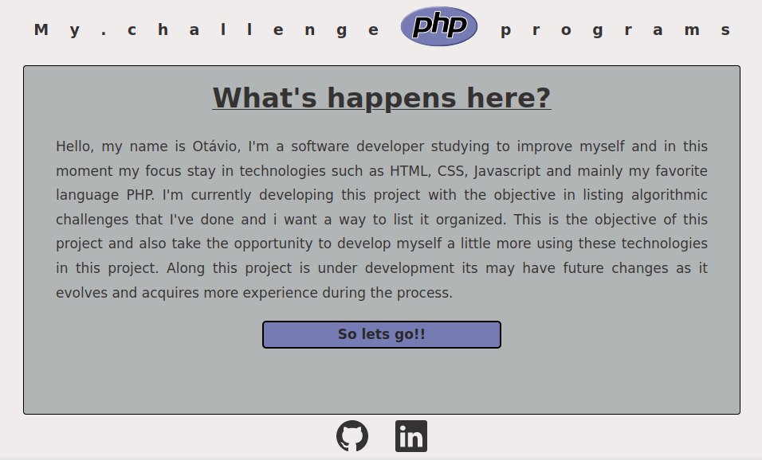
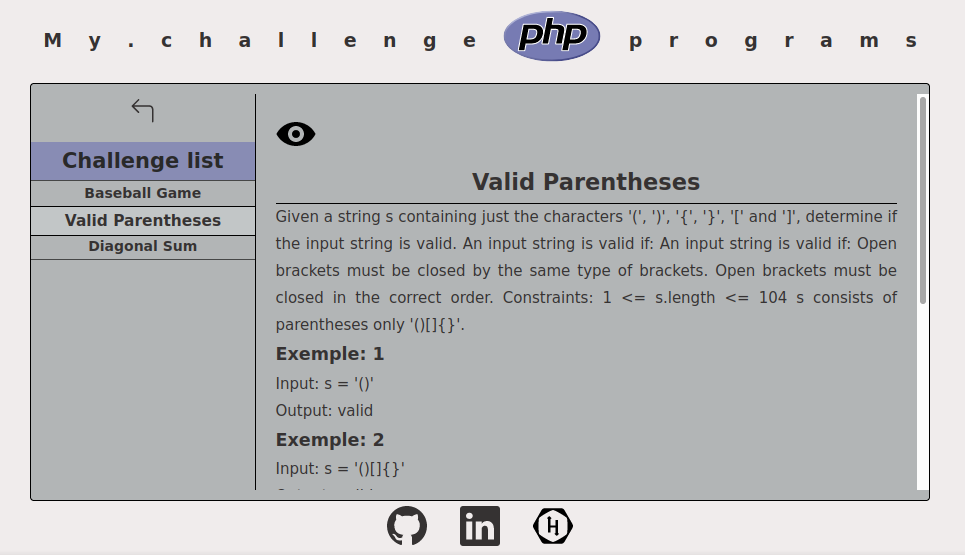

# PHP-CHALLENGE:

## Objetivo:

Ola meu nome é Otávio sou desenvolvedor de software e estou estudando para me aprimorar principalmente nas tecnologias como HTML, CSS, Javascript e principalente minha linguage preferida PHP.
No momento estou desenvolvendo este projeto com o objetivo de listar desafios algoritmos que fiz e queria uma maneira de listar estes desafios de uma forma mais organizada. Este é o objetivo deste projeto e tambem ja aproveito para me desenvolver um pouco mais usando estas tecnologias. Até o momento este projeto está em desemvolvimento e pode ter alterações futuras a medida que for evoluindo e adquirir mais esperiência durante o processo.

Esta sendo definido um padrao de pastas para os exercicios podendo ser atualizado.
Segue padrão utilizado ate o momento:

Pasta com nome padrao de [challenge-XX] sendo xx uma numeracao definida a medida que os exercicios sao adicionados no projeto.
A extrutura das pastas com o exercicios sera:
challenge[pasta]

challenge-xx.json
arquivo com a descricao do problema que com o padrao definido podera ser carregada na pagina inicial.

index.css
arquivo css caso seja necessario alguma formatacao para uma melhor visualizacao do exercicio em particular

index.php
arquivo principal onfi ficara o script do desafio

## Preview da pagina:

## Tecnologia utilizada:
* HTML
* CSS
* Composer
* GIT e GitHub