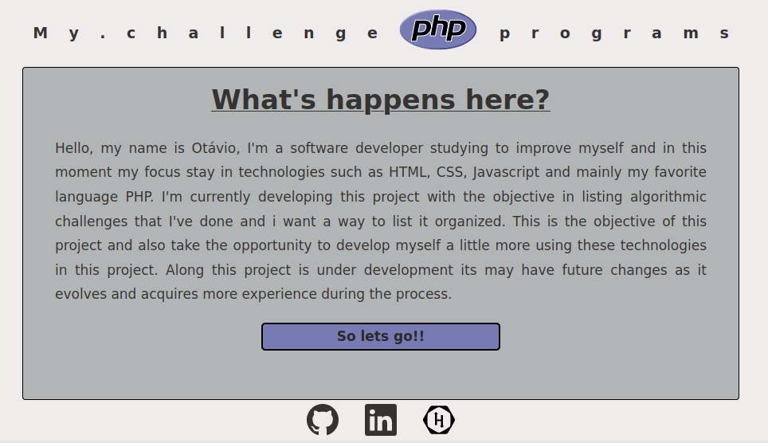

# PHP-CHALLENGE:

## Objetivo:

Ola meu nome é Otávio sou desenvolvedor de software e estou estudando para me aprimorar principalmente nas tecnologias como HTML, CSS, Javascript e principalente minha linguagem preferida PHP.
No momento estou desenvolvendo este projeto com o objetivo de listar desafios algoritmos que fiz e queria uma maneira de listar estes desafios de uma forma mais organizada. Este é o objetivo deste projeto e tambem ja aproveitar para me desenvolver um pouco mais usando estas tecnologias. Até o momento este projeto está em desenvolvimento e pode ter alterações futuras a medida que for evoluindo e adquirir mais esperiência durante o processo.

Os desafios estão organizados dentro do diretório [challenge] separados tambem por outros diretórios internos e dentro deles teram os seguintes arquivos:
### challenge-xx.json
arquivo com a descricao do problema que com o padrao definido podera ser carregada na pagina inicial.

### index.css
arquivo css caso seja necessário alguma formatação para uma melhor visualização do exercicio em particular

### index.php
arquivo principal onde ficara o script do desafio

## Preview da página:

## Observacao:
Caso seja feito o download do projeto sera necessario rodar o comando [composer update].

## Tecnologias:

